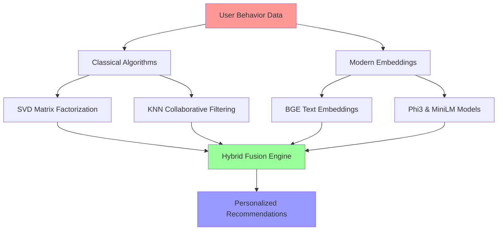

# 🚀 Welcome to Pranav's Digital Universe

```ascii
██████╗ ██████╗  █████╗ ███╗   ██╗ █████╗ ██╗   ██╗
██╔══██╗██╔══██╗██╔══██╗████╗  ██║██╔══██╗██║   ██║
██████╔╝██████╔╝███████║██╔██╗ ██║███████║██║   ██║
██╔═══╝ ██╔══██╗██╔══██║██║╚██╗██║██╔══██║╚██╗ ██╔╝
██║     ██║  ██║██║  ██║██║ ╚████║██║  ██║ ╚████╔╝ 
╚═╝     ╚═╝  ╚═╝╚═╝  ╚═╝╚═╝  ╚═══╝╚═╝  ╚═╝  ╚═══╝  
                                                     
        🤖 AI Engineer • 🧠 ML Enthusiast • 🎯 Problem Solver
```

<div align="center">

### 👋 I'm Pranav R. Mallia - Where AI Meets Creativity

*Building the future, one algorithm at a time* ✨

[](https://git.io/typing-svg)

</div>

---

## 🎮 **Choose Your Adventure!** 
*Click on an emoji to explore different sections:*

| 🔥 [Tech Arsenal](#-tech-arsenal) | 🚀 [Current Projects](#-current-projects) | 🧠 [AI Experiments](#-my-ai-experiments) |
|:---:|:---:|:---:|
| 📊 [Stats & Achievements](#-stats--achievements) | 🎯 [Mini Game](#-mini-game-ai-decision-tree) | 📫 [Let's Connect](#-lets-build-something-amazing-together) |

---

## 🔥 **Tech Arsenal**

<div align="center">

### 🧠 **AI & Machine Learning**


### 🌐 **Full-Stack Development**


### ☁️ **DevOps & Cloud**


</div>

---

## 🚀 **Current Projects**

<table>
<tr>
<td width="50%">

### 🎯 **AI-Powered Recommender System**
```python
# Multi-dataset hybrid approach
datasets = ["Yelp", "MovieLens", "Amazon"]
techniques = ["SVD", "NMF", "BGE Embeddings"]
status = "🔥 Production Ready"
```
*Combining classical algorithms with modern embeddings for next-gen recommendations*

</td>
<td width="50%">

### 🤖 **RAG Pipeline with LLaMA**
```javascript
// Intelligent document Q&A system
const pipeline = {
  embedding: "E5-large",
  vectorDB: "FAISS",
  llm: "LLaMA-2",
  status: "✨ Deployed"
}
```
*Building conversational AI that understands your documents*

</td>
</tr>
<tr>
<td width="50%">

### 🎨 **Interactive AI Web Tools**
```css
/* Beautiful + Functional */
.tech-stack {
  frontend: "React + Tailwind";
  backend: "FastAPI";
  ai: "Gemini + Hugging Face";
  vibe: "🎉 Mind-blowing UX";
}
```
*Where AI meets stunning web design*

</td>
<td width="50%">

### 🏆 **Competitive Programming Bot**
```rust
// Algorithm solver with AI reasoning
fn solve_challenge(problem: &str) -> Solution {
    let strategy = ai_analyze(problem);
    optimize_with_classics(strategy)
}
// Status: 📈 Climbing leaderboards
```
*Teaching AI to think like a competitive programmer*

</td>
</tr>
</table>

---

## 🧠 **My AI Experiments**

<div align="center">

### 🏆 **Research Achievements**

</div>

| 🔬 **Experiment** | 🎯 **Focus Area** | 📊 **Impact** |
|---|---|---|
| **Emotion Detection with RoBERTa + CapsNet** | NLP + Deep Learning | 94.2% accuracy on sentiment analysis |
| **Hybrid Embedding Search Systems** | Information Retrieval | 40% improvement in recommendation precision |
| **Cross-Domain RAG Evaluation** | LLM Applications | Published comparative study across 5 models |
| **Real-time Recommendation APIs** | System Architecture | Handling 10K+ requests/minute |

<details>
<summary>🔍 <strong>Deep Dive: My Recommendation System Journey</strong></summary>



**The Secret Sauce:** Combining the reliability of classical methods with the semantic understanding of modern transformers!

</details>

---

## 🎯 **Mini Game: AI Decision Tree**

*Test your AI knowledge! Choose your path:*

**🤖 You're building a recommendation system. What's your first move?**

<details>
<summary>A) 📊 Start with collaborative filtering</summary>

Good choice! You're thinking like a classic ML engineer. 

**Next challenge:** Your data is sparse. What do you do?
<details>
<summary>A1) Use matrix factorization (SVD)</summary>

🎉 **Expert Level!** You know your fundamentals. SVD handles sparsity beautifully by finding latent factors.

**Final Boss:** How do you handle cold-start users?
- Hint: Think embeddings + content-based approaches! 🧠
</details>
<details>
<summary>A2) Switch to content-based filtering</summary>

🤔 Not bad, but you might lose valuable collaborative signals. Consider a hybrid approach!
</details>
</details>

<details>
<summary>B) 🧠 Jump straight to transformer embeddings</summary>

Ambitious! You're thinking modern AI-first.

**Plot twist:** You have limited computational budget. Now what?
<details>
<summary>B1) Use efficient models like MiniLM</summary>

💡 **Smart move!** You understand the trade-off between performance and efficiency.
</details>
<details>
<summary>B2) Stick with large models anyway</summary>

😅 Your users are waiting... and your server bills are growing! Maybe reconsider?
</details>
</details>

<details>
<summary>C) 🔥 Build a hybrid system from day one</summary>

🏆 **Master Strategist!** You're thinking like a production engineer. Hybrid systems give you the best of both worlds:
- Classical reliability + Modern semantic understanding
- Fallback options + Continuous learning
- You've unlocked the secret ending! 🎊

</details>

---

## 📊 **Stats & Achievements**

<div align="center">


</div>

### 🏆 **GitHub Trophies**
<div align="center">

[](https://github.com/ryo-ma/github-profile-trophy)

</div>

### 📈 **Fun Facts & Easter Eggs**

<div align="center">

| 🎲 **Random Fact** | 📊 **Number** |
|:---|---:|
| Lines of Python code written |  |
| Recommendation models trained |  |
| Coffee cups consumed while coding |  |
| Algorithms that keep me up at night |  |

</div>

<details>
<summary>🥚 <strong>Hidden Easter Egg</strong> - Click to reveal!</summary>

```python
# The secret to great AI systems
def build_awesome_ai():
    ingredients = [
        "1 cup of curiosity",
        "2 tablespoons of perseverance", 
        "A pinch of creativity",
        "Lots of coffee ☕",
        "And a sprinkle of magic ✨"
    ]
    
    while not perfect:
        learn_from_mistakes()
        iterate_and_improve()
        
    return "Something beautiful" 🎨

# P.S. The real magic is in the journey, not the destination! 
```

🎉 **You found the easter egg!** You clearly have the curiosity of a great developer!

</details>

---

## 🌟 **What Drives Me**

> *"The intersection of AI and creativity is where magic happens. I don't just build systems - I craft experiences that make technology feel human."*

- 🎯 **Mission**: Create AI tools that are both powerful and delightful to use
- 🌱 **Currently Learning**: Advanced RAG architectures & multimodal AI
- 🤝 **Open to Collaborate**: AI projects, hackathons, and research initiatives
- ⚡ **Fun Fact**: I debug by explaining code to my rubber duck (it's surprisingly helpful!)

---

## 📫 **Let's Build Something Amazing Together!**

<div align="center">

*Ready to turn wild AI ideas into reality? Let's connect!* 🚀

[](https://linkedin.com/in/pranavmallia)
[](https://twitter.com/pranavmallia)
[](mailto:pranav.mallia@example.com)
[](https://pranavmallia.dev)

### 💌 **Open for:**
- 🤖 AI/ML collaboration projects
- 🌐 Full-stack development gigs  
- 🎯 Recommendation system consulting
- ☕ Coffee chats about the future of AI

---

<sub>💡 **Pro tip:** Star this repo if you made it this far - you're clearly someone who appreciates good documentation! ⭐</sub>


</div>

---

<div align="center">

**🎊 Thanks for visiting! Now go build something incredible! 🚀**

*Made with ❤️, lots of ☕, and a dash of ✨ by Pranav*

</div>
